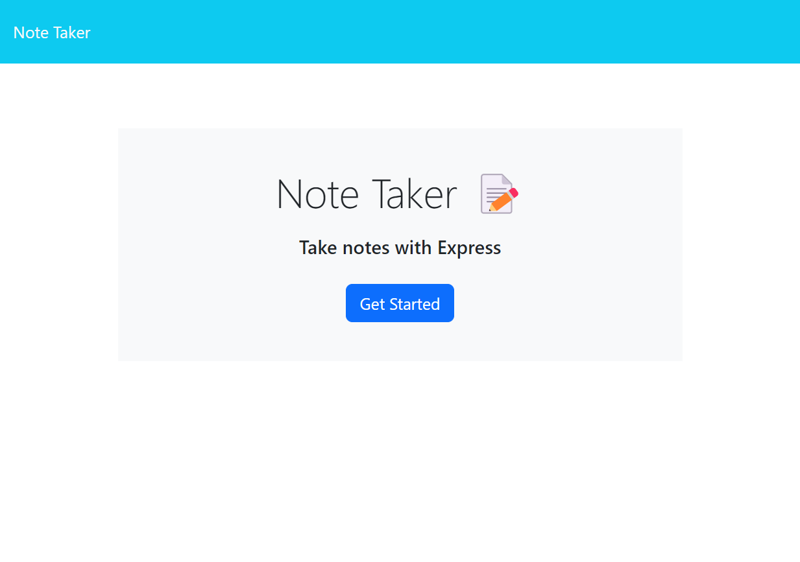
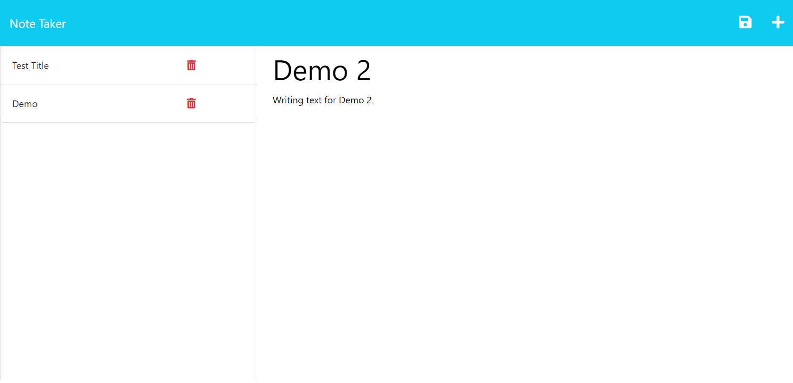

# Team Profile Generator

  

  ## Description
  This is a simple application called Note Taker that can be used to write and save notes. This application uses an Express.js back end and will save and retrieve note data from a JSON file.

  ## Table of Contents

  * [Installation](#installation)
  * [Usage](#usage)
  * [Contributing](#contrubuting)
  * [License](#license)
  * [Questions](#questions)

  ## Installation

  To access codebase,

  - Go to https://github.com/GuyJiawei/express.js_note_taker
  - Click Code
  - Clone onto local device by copying the link https://github.com/GuyJiawei/express.js_note_taker.git into gitbash/terminal on your machine
  - Open files in preferred text editor
  - Open Integrated terminal and run npm i to install dependencies

  ## Usage

  The following images show the web application's appearance and functionality:
  
  

  ## Contributing

  Contribution to this project will not be accepted, unfortunately. Thank you for your interest!

  
  ## License
  - MIT
  - https://choosealicense.com/licenses/MIT/
  - A short and simple permissive license with conditions only requiring preservation of copyright and license notices. Licensed works, modifications, and larger works may be distributed under different terms and without source code.
  

  ## Questions

  If you have any questions or require further information, please contact me at:

  - GitHub: https://github.com/GuyJiawei
  - Email: guy.jiawei.anderson@gmail.com

  
